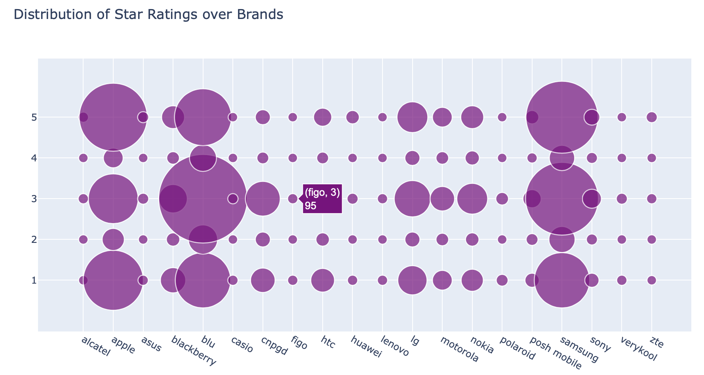

## Amazon Reviews MVP

Introduction
============

In this project, we collected people textual reviews about different purchased products from Amazon. the data set contains approximately 413,000 customer reviews including products prices, final customer ratings and the products' names.

Approach
========

We are going to follow the steps below in order to systematically answer the research questions posed in `Research Question(s)` section above.

- We will use Natural Language Processing (NLP) methods and techiques to preprocess the textual data and convert them into suitable numerical formats compatible with different machine learning algorithms.

- We will use the processed data to computationally calculate the sentiment of the customer to a product.

- We will use the processed data to calculate the similarity between customers' reviews and predict sentiments for future reviews using classification models.

- We will apply PCA-SVD techniques in order to reduce the dimensions of the data and improve the prediction through utilizing the latent dimensions discovered by those methods.

- Moreover, we will apply Non negative Matrix Factorization (NMF) and Linear Semantic Analysis (LSA) on smaller data set to diagnose any problems. Afterwards, we will implement Linear Discriminant Analysis (LSA) on the whole data set.

- We will perform Topic Modeling on negative and positive sentiments separately.

Data Description
================

- We used publicly available data set from KAGGLE website for Amazon Customer reviews.
- The data set contains approximately 413,000 Records, with initial 6 features/columns. The following table shows the general layout of the first few records.

Objectives
==========

- Using unsupervised machine learning techniques along with NLP methods to understand customers’ sentiments over different products.
- Explain the differences between customers’ reviews based on latent topics contained within to better tailor future marketing and product improvements.

Results
=======

- We utilized unsupervised machine learning techniques to gain more insights into mobile products reviews of amazon.
- The dataset contains approximately 417000 records which explain customers’ ratings , sentiments and reviews over a set of predefined mobile products

### Data Understanding

 

 

 

 

 

 

